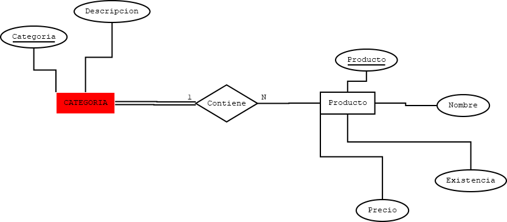

# Requerimientos
Una empresa encargada de las ventas de diferentes productos desea crear una base de datos que controle los proveedores, clientes, empleados, categorías de producto y órdenes de compra.
Para los proveedores se necesita almacena un numero de consto, nombre de empresa, dirección que costa de número, calle, colonia y estado, código postal, teléfono página web teléfono de contacto o contactos del proveedor, nombre del contacto, e-mail del contacto. Para los empleados se desea almacenar un numero de nómina, nombre completo del empleado, RFC, CURP y salario (el salario no puede ser negativo y el máximo es de $65,000.00.), para las ordenes de compra se necesita crear la fecha de creación de la orden, el empleado que la realizo, al cliente que se le vende, la fecha de entrega y ls diferentes productos que contiene. El producto debe almacenar un numero de control, una descripción única, la existencia y un precio. La categoría debe tener un identificador y nombre único de categoría. La compra siembre debe tener un precio de venta que se obtien del precio unitario del producto y una cantidad vendida.

# Diagrama cosneptual E-R

# Diagrama Lógico Relacional

# Diagrama fisico con SQL-LDD

# Llenado de BD con SQL-LMD

# Consultas Simples